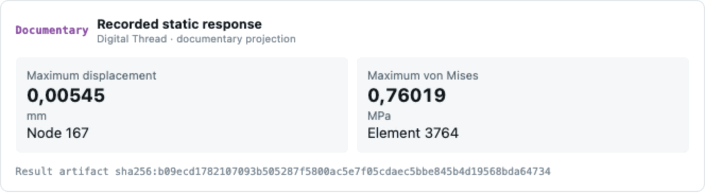

# @casys/mcp-calculix

[](https://jsr.io/@casys/mcp-calculix)
[](https://github.com/Casys-AI/mcp-calculix/actions/workflows/publish.yml)
[](LICENSE)

Bounded finite-element analysis for STEP parts, exposed as an MCP server and a
compact MCP App. Gmsh creates the tetrahedral mesh, CalculiX performs the
analysis, and the server returns closed, unit-bearing observations.

```text
STEP bytes -> SHA-256 snapshot -> Gmsh mesh -> generated CalculiX deck
           -> parsed observations -> optional recorded evidence -> MCP App
```



<sub>Actual TPS03 recorded session replayed through the read-only
<code>viewer.session.apply</code> action. “Documentary” is literal: this view
reports two observations and their result-artifact identity, never an
engineering verdict.</sub>

Source version `0.8.4` adds an exact serialized App contract, strict joins for
recorded viewer sessions, and a single responsive result component. The server
is deliberately not a generic CalculiX shell: callers provide STEP geometry and
reviewed physical values, not arbitrary decks, commands, executables, or flags.

## What it covers

- Mesh and named-selection preflight before solve physics.
- Linear static, modal, linear buckling, Norton-law creep, and steady-state
  coupled temperature-displacement analyses.
- A recorded static path with idempotent request identity, exact evidence
  resources, recovery states, and replay validation.
- One App-owned static-result view for ordinary results, recorded fleet runs,
  and exact Digital Thread projections.

The server reports solver observations. It does not infer loads or materials,
approve a design, or turn a successful run into a safety, compliance, or
requirement conclusion. See [analysis contracts](docs/analysis-contracts.md) and
[honest limits](docs/analysis-contracts.md#honest-limits).

## Run the released server

Release `0.8.4` publishes to JSR and as a multi-architecture image for
`linux/amd64` and `linux/arm64`. The GitHub release records the exact OCI index
digest; use that immutable identity rather than a tag:

`ghcr.io/casys-ai/mcp-calculix:0.8.4` is a mutable discovery tag, not a
qualified deployment identity. `latest` is mutable too.

```bash
RELEASE_IDENTITY_URL=https://github.com/Casys-AI/mcp-calculix/releases/download/v0.8.4/release-identity.json
curl -fsSLo release-identity.json "$RELEASE_IDENTITY_URL"
IMAGE_REF="$(jq -er '.image | select(test("^ghcr\\.io/casys-ai/mcp-calculix@sha256:[0-9a-f]{64}$"))' release-identity.json)"
docker pull "$IMAGE_REF"
```

Run the stateless HTTP transport on loopback, with STEP inputs read-only and
recorded evidence on a persistent volume:

```bash
docker run --rm --name mcp-calculix \
  -p 127.0.0.1:3015:3015 \
  -v /absolute/path/to/step-files:/inputs:ro \
  -v calculix-runs:/var/lib/mcp-calculix-runs \
  -e CALCULIX_RUNS_DIRECTORY=/var/lib/mcp-calculix-runs \
  "$IMAGE_REF" http
```

The MCP endpoint is `http://127.0.0.1:3015/mcp`. For native stdio from JSR:

```bash
deno run --allow-all jsr:@casys/mcp-calculix@0.8.4/server --stdio
```

Or configure stdio from the released image:

```json
{
  "mcpServers": {
    "calculix": {
      "command": "docker",
      "args": [
        "run",
        "--rm",
        "-i",
        "-v",
        "/absolute/path/to/step-files:/inputs:ro",
        "-v",
        "calculix-runs:/var/lib/mcp-calculix-runs",
        "-e",
        "CALCULIX_RUNS_DIRECTORY=/var/lib/mcp-calculix-runs",
        "ghcr.io/casys-ai/mcp-calculix@sha256:<digest from release-identity.json>",
        "stdio"
      ]
    }
  }
}
```

Container calls must use paths visible inside the container, such as
`/inputs/bracket.step`. Keep one active writer per recorded-run volume.

## Viewer and evidence

The server serves its whole-view resource at `ui://mcp-calculix/results-viewer`
and its machine-readable App manifest at `ui://mcp-calculix/app-manifest`. The
viewer is one semantic `calculix.static-result` component: result identity,
maximum displacement, maximum von Mises stress, and compact provenance. It never
calls a solve.

Recorded static runs retain the exact STEP snapshot, request, Gmsh program and
mesh, generated deck, native diagnostics, DAT output, and normalized result.
Every resource read is checked against the durable ledger before publication.
The full contract, recovery model, TPS03 capture identity, and Digital Thread
boundary are documented in
[Recorded runs and viewer](docs/recorded-runs-and-viewer.md).

## Documentation

- [Analysis contracts, units, examples, and limits](docs/analysis-contracts.md)
- [Recorded runs, evidence resources, and MCP App](docs/recorded-runs-and-viewer.md)
- [Deployment, transports, security, and operations](docs/deployment-and-operations.md)
- [Development and release gates](docs/development.md)
- [Changelog](CHANGELOG.md) · [Security policy](SECURITY.md)

## Develop

Deno 2.9.6 is the release toolchain. Gmsh and CalculiX are required only for the
opt-in native end-to-end gate.

```bash
deno task release:check
CALCULIX_RUN_NATIVE=1 deno task test
```

Building the App source also requires the three explicit local split package
roots described in [Development](docs/development.md#viewer-build). Runtime
consumers use the shipped single-file resource and do not need those packages.

## Citation and license

Citation metadata is in [CITATION.cff](CITATION.cff). Licensed under the
[MIT License](LICENSE).
